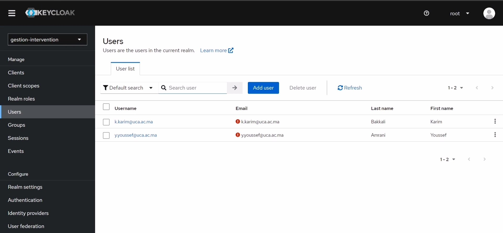

# Spring Boot - Angular Project 

This project is a Spring Boot backend combined with an Angular frontend for managing interventions, assignments, and other operations related to academic scheduling.

## Overview

The project aims to provide a comprehensive system for managing various tasks related to academic scheduling, including:

- Managing interventions between Enseignants and Modules
- Creating and adding Filieres and Modules
- Updating information related to volume horaire of Modules
- User authentication and authorization with login functionality for Administrateurs and Enseignants
- Role-based access control (Admin has full access, Enseignant has limited access)

## Features

- **Administrator Dashboard**: Administrateurs have access to a dashboard where they can perform all management operations, including creating, updating, and deleting entities.
- **Enseignant Dashboard**: Enseignants have limited access and can view list of their own interventions at modules.
- **User Authentication**: Login functionality with authentication and authorization to ensure secure access to the system (using Keycloak).
- **CRUD Operations**: Support for creating, reading, updating, and deleting interventions, modules.

## Administrator Dashboard

When an administrator logs into the application, they are greeted with a comprehensive dashboard that allows them to manage all aspects of the system. Below is an example of the administrator dashboard:


## Class Diagram

The class diagram illustrates the structure of the entities involved in the project, including Enseignant, Module, Filiere, Administrator and Intervention.


## Backend Setup

1. Navigate to the `Spring-Boot` folder.
2. Open the project in your preferred IDE (e.g., IntelliJ IDEA, Eclipse).
3. Run the `Application` class located at `com.masterISI` package, in order to start the Spring Boot backend.


> **Note:** If you would like to run the app without using an editor, ensure that Maven is set up on your system. You can run the backend using the command:
> 
> ```sh
> mvn spring-boot:run
> ```
> 
> from the directory where the `pom.xml` file is located.

## Database Configuration

The project comes pre-configured with database settings. Follow these steps to create the database:

1. Make sure you have MySQL installed on your system.
2. Connect to your MySQL server using your preferred MySQL client (e.g., MySQL Workbench, XAMPP).
3. Execute the following SQL script to create the database:

```sql
CREATE DATABASE gestionchargehoraire;
```
## Keycloak

### Keycloak Angular App Flow Exchange


The flow exchange between Keycloak and Angular ensures secure authentication and authorization for users interacting with the application.

### Keycloak Setup Instructions

To ensure that your application works properly with Keycloak, follow these steps:

#### Step 1: Install Docker

Download and install Docker from the official Docker website:

[Download Docker](https://www.docker.com/products/docker-desktop)

#### Step 2: Download Keycloak Image

Download the Keycloak image from Docker Hub by running the following command in your terminal:

```sh
docker pull quay.io/keycloak/keycloak:latest
```
#### Step 3: Run Keycloak using Docker Compose

Create a docker-compose.yml file to define and run the Keycloak container. This file will also map the necessary ports.

```yaml
version: '3'

services:
  keycloak:
    image: quay.io/keycloak/keycloak:latest
    environment:
      - KEYCLOAK_USER=admin
      - KEYCLOAK_PASSWORD=admin
    ports:
      - "8080:8080"
    command:
      - start-dev
```

#### Run the Docker Compose Setup

```sh
docker-compose up -d
```

#### Step 4: Access Keycloak

Once the container is running, go to the following URL to access the Keycloak admin console:  
[http://localhost:8080](http://localhost:8080)

Log in with the admin username and password specified in the `docker-compose.yml` file (admin/admin).

#### Step 5: Configure Keycloak

#### Create a Realm

In the Keycloak admin console, click on the Master dropdown in the top-left corner and select **Add realm**.  
Name the realm `gestion-intervention`.

#### Create a Client

Go to the **Clients** tab in your new realm.  
Click **Create** to add a new client.  
Fill in the necessary details such as Client ID, Root URL, Redirect URIs, etc. as per your application's requirements.

#### Create Roles

Go to the **Roles** tab in your new realm.  
Create two roles:
- `ADMINISTRATEUR`
- `ENSEIGNANT`

#### Create Users and Assign Roles

Go to the **Users** tab.  
Click **Add user** and fill in the required details for each user.  
Create two users: one for `enseignant` and one for `administrateur`.  
After creating a user, go to the **Role Mappings** tab for that user and assign the appropriate role (either `ADMINISTRATEUR` or `ENSEIGNANT`).

### Configure Database Integration

Make sure that the users created in Keycloak are also stored in your `gestionchargehoraire` database.  
This might require custom integration logic in your backend application to sync users between Keycloak and your database.



### Final Note

Ensure that all configurations are saved and the realm is correctly set up with the specified roles and users.  
Verify that your application can communicate with Keycloak for authentication and authorization purposes.


## Frontend Setup

The Angular frontend for this project is ready for setup. Follow these steps to set up and run the frontend:

1. Navigate to the `gestionHoraire-Angular` folder.
2. Open a terminal or command prompt in this directory.
3. Run `npm install` to install all required dependencies.
4. Once installation is complete, run `ng serve --open` to start the Angular server and automatically open the application in your default web browser.


## Contributors

- Imad BELATTAR
- Haitam CHEFIRA

## License

This project is licensed under the MIT License - see the [LICENSE](LICENSE) file for details.


